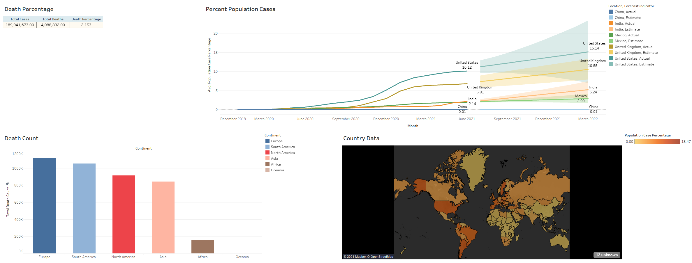

# Covid Data Analyst Project
---
## Data Analysis and Visualization project using Microsoft SQL tools, SQL, Excel and Tableau

This project is analyzing, cleaning, querying and prepraring data for visualization using Tableau.

You can find my Tableau workbook for this projects visualization **here**: https://public.tableau.com/app/profile/cheyenne7414/viz/covidDataAnalysis/Dashboard1

----

You can find the data set used **here**: https://ourworldindata.org/covid-deaths

You can find information regarding the data **here**: https://github.com/owid/covid-19-data/tree/master/public/data

----

### Sample data used for "Percent Population Cases"

| Location   | Population | date      | highest\_case\_count | population\_case\_percentage |
| ---------- | ---------- | --------- | -------------------- | ---------------------------- |
| Andorra    | 77265      | 5/8/2021  | 13406                | 17.35067624                  |
| Andorra    | 77265      | 5/7/2021  | 13390                | 17.32996829                  |
| Andorra    | 77265      | 5/6/2021  | 13363                | 17.29502362                  |
| Seychelles | 98340      | 7/15/2021 | 17005                | 17.292048                    |
| Seychelles | 98340      | 7/12/2021 | 17005                | 17.292048                    |
| Seychelles | 98340      | 7/13/2021 | 17005                | 17.292048                    |
| Seychelles | 98340      | 7/14/2021 | 17005                | 17.292048                    |
| Andorra    | 77265      | 5/5/2021  | 13340                | 17.26525594                  |
| Andorra    | 77265      | 5/4/2021  | 13316                | 17.23419401                  |        |
| Andorra    | 77265      | 4/28/2021 | 13148                | 17.0167605                   |
| Andorra    | 77265      | 4/27/2021 | 13121                | 16.98181583                  |
| Seychelles | 98340      | 7/9/2021  | 16679                | 16.96054505                  |
| Seychelles | 98340      | 7/8/2021  | 16679                | 16.96054505                  |
| Seychelles | 98340      | 7/10/2021 | 16679                | 16.96054505                  |
| Seychelles | 98340      | 7/11/2021 | 16679                | 16.96054505                  |
| Andorra    | 77265      | 4/26/2021 | 13083                | 16.93263444                  |
| Andorra    | 77265      | 4/25/2021 | 13060                | 16.90286676                  |
| Andorra    | 77265      | 4/24/2021 | 13024                | 16.85627386                  |
| Andorra    | 77265      | 4/23/2021 | 13007                | 16.83427166                  |
| Andorra    | 77265      | 4/22/2021 | 12942                | 16.7501456                   |
| Andorra    | 77265      | 4/21/2021 | 12917                | 16.71778943                  |
| Andorra    | 77265      | 4/20/2021 | 12874                | 16.6621368                   |
| Seychelles | 98340      | 7/7/2021  | 16304                | 16.57921497                  |
| Seychelles | 98340      | 7/6/2021  | 16304                | 16.57921497                  |
| Seychelles | 98340      | 7/5/2021  | 16304                | 16.57921497                  |
| Andorra    | 77265      | 4/19/2021 | 12805                | 16.57283375                  |         |
| Andorra    | 77265      | 4/12/2021 | 12581                | 16.28292241                  |
| Andorra    | 77265      | 4/11/2021 | 12545                | 16.23632952                  |
| Andorra    | 77265      | 4/10/2021 | 12497                | 16.17420566                  |
| Seychelles | 98340      | 7/2/2021  | 15857                | 16.12466951                  |
| Seychelles | 98340      | 7/3/2021  | 15857                | 16.12466951                  |
| Seychelles | 98340      | 7/4/2021  | 15857                | 16.12466951                  |
| Andorra    | 77265      | 4/9/2021  | 12456                | 16.12114153                  |
| Andorra    | 77265      | 4/8/2021  | 12409                | 16.06031191                  |
| Montenegro | 628062     | 7/18/2021 | 100662               | 16.02739857                  |
| Montenegro | 628062     | 7/17/2021 | 100622               | 16.02102977                  |
| Montenegro | 628062     | 7/16/2021 | 100590               | 16.01593473                  |
| Montenegro | 628062     | 7/15/2021 | 100567               | 16.01227267                  |
| Montenegro | 628062     | 7/14/2021 | 100543               | 16.00845139                  |
| Montenegro | 628062     | 7/13/2021 | 100519               | 16.00463012                  |
| Andorra    | 77265      | 4/7/2021  | 12363                | 16.00077655                  |
| Montenegro | 628062     | 7/12/2021 | 100488               | 15.9996943                   |
| Montenegro | 628062     | 7/11/2021 | 100478               | 15.9981021                   |
| Montenegro | 628062     | 7/10/2021 | 100459               | 15.99507692                  |
| Montenegro | 628062     | 7/9/2021  | 100430               | 15.99045954                  |
| Montenegro | 628062     | 7/8/2021  | 100414               | 15.98791202                  |
| Montenegro | 628062     | 6/23/2021 | 100117               | 15.9406237                   |
| Montenegro | 628062     | 6/22/2021 | 100104               | 15.93855384                  |
| Montenegro | 628062     | 6/21/2021 | 100092               | 15.9366432                   |

## SQL Queries used for each table for visualization

1.)

```
Select SUM(new_cases) as total_cases, SUM(cast(new_deaths as int)) as total_deaths, SUM(cast(new_deaths as int))/SUM(new_cases) * 100 as death_percentage
From covidDataProject..covidDeaths
Where continent is not null 
Order by 1,2 
```

2.)

```
Select location, SUM(cast(new_deaths as int)) as total_death_count
From covidDataProject..covidDeaths
Where continent is null
and Location not in ('World','European Union','International')
Group by Location
Order by total_death_count desc
```

3.)
```
Select Location, Population, MAX(total_cases) as highest_case_count, MAX((total_cases/population)) * 100 as population_case_percentage
From covidDataProject..covidDeaths
Group by Location, Population
order by population_case_percentage desc
```

4.)

```
Select Location, Population, date, MAX(total_cases) as highest_case_count, MAX((total_cases/population)) * 100 as population_case_percentage
From covidDataProject..covidDeaths
Group by Location, Population, date 
Order by population_case_percentage desc
```

## Screen Shots

- screen shot of Tableau workbook dashboard 



📋 Copy